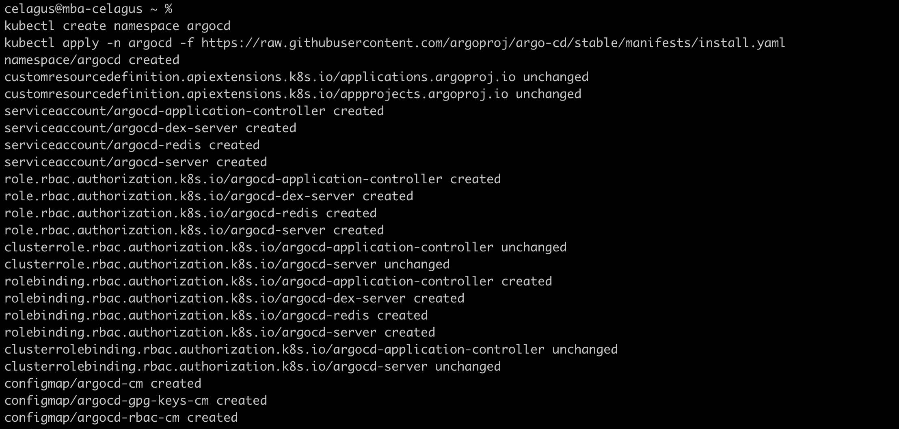
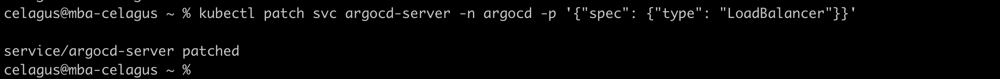
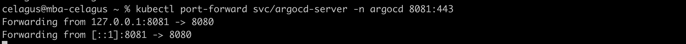
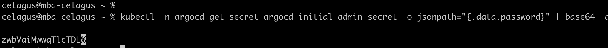
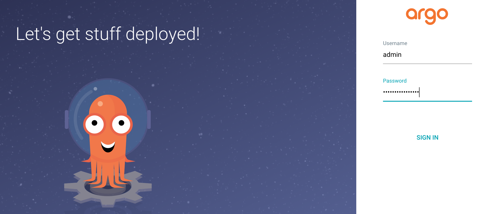
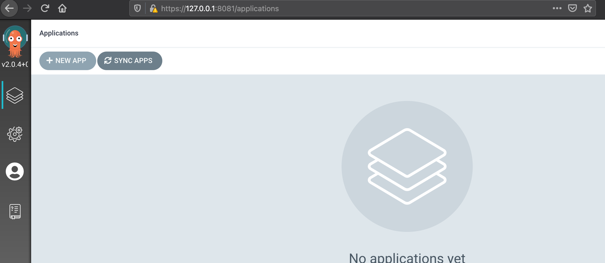
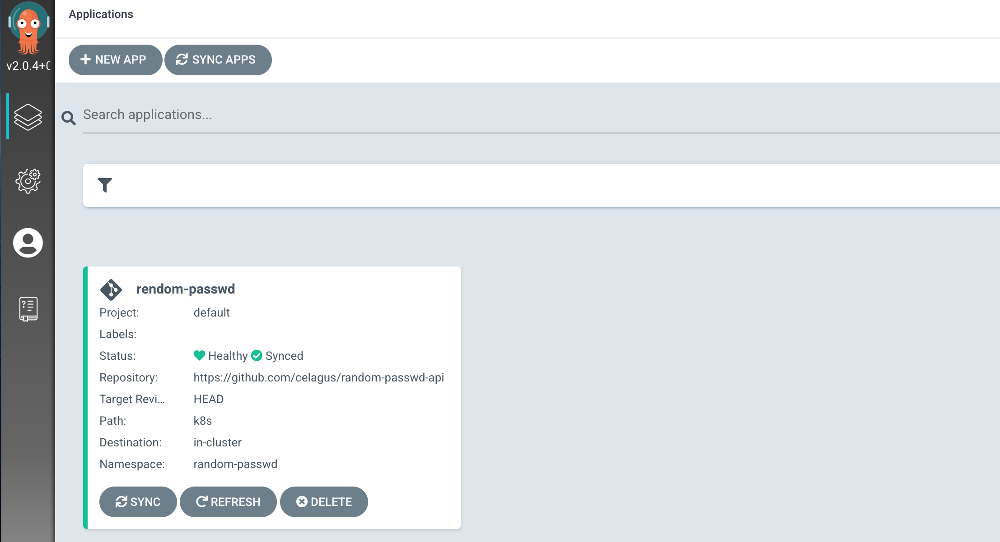
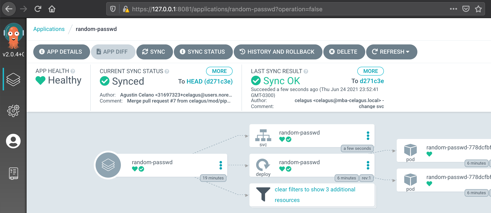
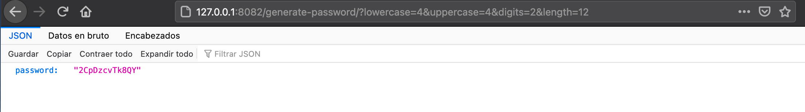

# Ejercicio 3: Basic GitOps CD Pipeline

## Intro
Bienvenidxs! Este es el tercer ejercicio del módulo de DevSecOps de Ekoparty Hackademy. En los ejercicios anteriores aprendieron a usar Git de forma básica. En esta oportunidad abordaremos el enfoque de trabajo GitOps utilizando herramientas de Continuous Deployment (CD) e Infrastructure-as-Code (IaC).

### ¿Qué es GitOps?
Es un enfoque de trabajo que propone al Sistema de Control de Versiones (VCS) Git como principal fuente de confianza para versionar y getionar infraestructura como código (IaC) y aplicaciones. Los cambios se introducen a través de PR/MR y los rollouts/rollbacks se producen en forma automática a través de pipelines declarativos.

## Requisitos
* Tener instalado y corriendo un cluster local de Kubernetes - [Guía de instalación minikube](https://minikube.sigs.k8s.io/docs/start/) o [Guía de instalación Docker for Desktop](https://www.docker.com/products/docker-desktop) y [activación de K8s en Docker for Desktop](https://docs.docker.com/desktop/kubernetes/)  (opción recomendada).


## Instalación ArgoCD

1. Instalar ArgoCD en Kubernetes
```
kubectl create namespace argocd
kubectl apply -n argocd -f https://raw.githubusercontent.com/argoproj/argo-cd/stable/manifests/install.yaml
```


Aguardar a que terminen de levantar los pods. Podemos chequear con el siguiente comando si los pods fueron creeados y están en status "running"
```
kubectl get pods -n argocd
```


2. Cambiar service de ArgoCD a tipo LoadBalancer
```
kubectl patch svc argocd-server -n argocd -p '{"spec": {"type": "LoadBalancer"}}'

```


3. Exponer ArgoCD service a través del host local
```
kubectl port-forward svc/argocd-server -n argocd 8081:443
```


4. Obtener el valor del "secreto" de Kubernetes para el usuario admin de ArgoCD (este se crea automáticamente durante la instalación)
```
kubectl -n argocd get secret argocd-initial-admin-secret -o jsonpath="{.data.password}" | base64 -d
```


5. Ingresar como admin a ArgoCD a través de un browser con la URL "https:/127.0.0.1:8081" utilizando el usuario "admin" junto con la secret obtenida en el paso anterior



## Configuración ArgoCD

1. En la consola de administración dirigirse a "New App"


2. Configurar los parámetros como se especifican a continuación y confirmar:

* Application name: rendom-passwd
* Project: default
* Sync policy: automatic
* Sync options: auto-create namespace
* Repository URL: https://github.com/celagus/random-passwd-api
* Path: k8s
* Cluster URL: debería aparecerte algo como "https://kubernetes.default.svc"
* Namespace: random-passwd

El resultado debería verse asi:


4. Clickear en el nuevo deployment creado y observar el número de pods creados (deberían ser 2, tal cuál se especifica en el [manifiesto origen](https://github.com/celagus/random-passwd-api/blob/main/k8s/deployment.yml#L8)) junto con su estado de salud


5. Si está todo correcto hasta aquí, deberías poder forwardear el servicio de Kubernetes a tu host local  con el siguiente comando:
```
kubectl port-forward svc/random-passwd -n random-passwd 8082:8082
```
luego acceder a través del nevegador colocando la siguiente URL:
```
http://127.0.0.1:8082/generate-password/?lowercase=4&uppercase=4&digits=2&length=12
```

Deberías obtener un resultado similar al siguiente:


Nótese que en la carpeta [k8s](https://github.com/celagus/random-passwd-api/tree/main/k8s) del proyecto se encuentran los manifiestos que le permiten a Argo entender qué implementar y de qué manera. Si prestan atención a [esta línea](https://github.com/celagus/random-passwd-api/blob/main/k8s/deployment.yml#L18) del file *deployment.yml*, el manifiesto indica que la imagen de contenedor a utilizar es "random-passwd-api" del desarrollador "celagus" en la registry oficial de Docker (Docker Hub). Si se fijan en el file [.github/workflows/pipeline.yml](https://github.com/celagus/random-passwd-api/blob/main/.github/workflows/pipeline.yml) del proyecto verán que hay definido un pipeline de GitHub Actions para generar una nueva imagen del proyecto y subirla a la registry cada vez que se "pushea" un nuevo commit en el repo. En el siguiente ejercicio profundizaremos sobre cómo sacar provecho de la funcionalidad Github Actions para crear pipelines.

## Destruir toda la implementación anterior

```
kubectl delete ns argocd
kubectl delete ns random-passwd
```
